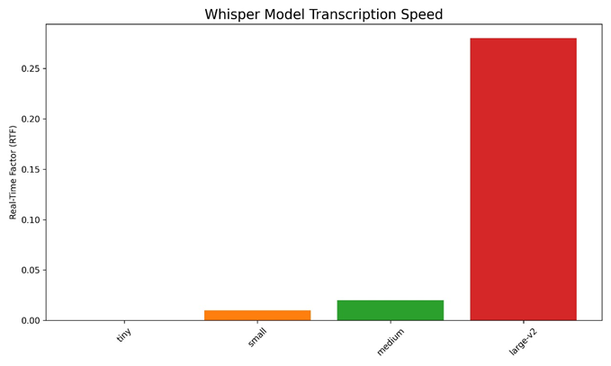
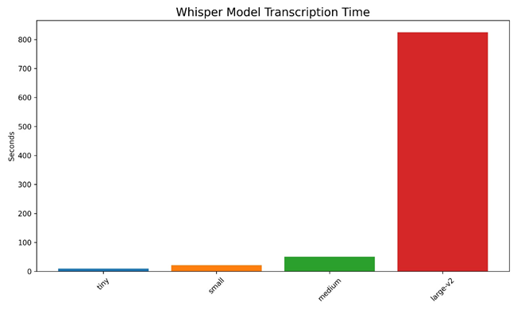

## Whisper Processing and Statistics

- Whisper's small and medium models hit the right balance for most transcription work. 

- They give good results without being too slow or using too much computer power

- Whisper_s2t offers faster inference and better memory management compared to the original Whisper library. 

- It uses CTranslate2 backend to optimize performance, making it more practical for real-world speech-to-text applications.

- Whisper model Transcription Speed

- Whisper Model Transcription Time

